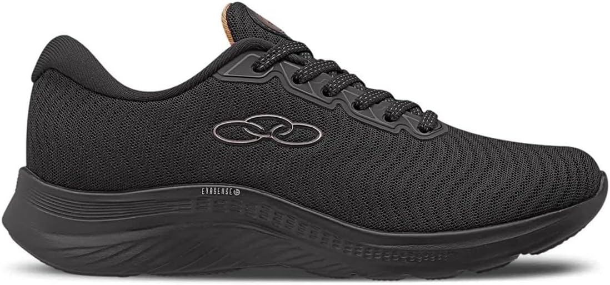

# 🛒 Desafio Frontend - E-commerce de Produto Único

Este projeto foi desenvolvido como parte de um **desafio técnico para uma vaga de desenvolvedor frontend**. A aplicação simula uma página de e-commerce para visualização de um único produto, com funcionalidades como galeria de imagens, seleção de variantes (tamanho e cor), e verificação de entrega via CEP.

## 🚀 Funcionalidades

- 📸 **Galeria de Imagens** interativa do produto.
- 🎨 **Seleção de Cor** e **Tamanho** com atualização dinâmica do estado.
- 📦 **Verificador de Entrega por CEP**, com consumo de uma **API externa**.
- 💾 **Persistência local automática**: as seleções do usuário (imagem, cor, tamanho, CEP) são salvas no `localStorage` por até 15 minutos.

## 🖼️ Demonstração

  
*Interface limpa, responsiva e com foco na experiência do usuário.*

## 🛠️ Tecnologias Utilizadas

- [React](https://reactjs.org/)
- [Tailwind CSS](https://tailwindcss.com/)
- JavaScript (ES6+)
- API externa para consulta de CEP (como `viacep.com.br`)
- LocalStorage para persistência dos dados temporários

## 📂 Estrutura do Projeto

src/  
│  
├── components/  
│ ├── ProductGallery.jsx  
│ ├── VariantSelector.jsx  
│ └── DeliveryChecker.jsx  
│  
├── pages/  
│ └── ProductPage.jsx  
│  
├── assets/  
│ └── img1.jpg ...  
│  
├── css/  
│ └── ProductPage.css  
│  
└── App.jsx  

📫 Contato
Desenvolvido por David Souza
📱 linkedin.com/in/davidsouza-coder

💡 Este projeto foi desenvolvido com foco em boas práticas de desenvolvimento, código limpo e experiência do usuário. Agradeço pela oportunidade!

